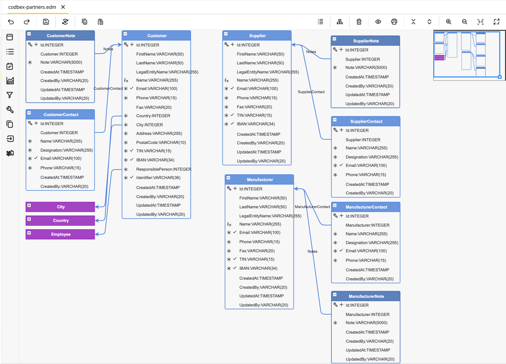

#  codbex-partners

## 📖 Table of Contents
* [🗺️ Entity Data Model (EDM)](#️-entity-data-model-edm)
* [🧩 Core Entities](#-core-entities)
* [📦 Dependencies](#-dependencies)
* [🐳 Local Development with Docker](#-local-development-with-docker)

## 🗺️ Entity Data Model (EDM)



## 🧩 Core Entities

### Entity: `Customer`

| Field             | Type      | Details              | Description                         |
| ----------------- | --------- | -------------------- | ----------------------------------- |
| Id                | INTEGER   | PK, Identity         | Unique identifier for the customer. |
| FirstName         | VARCHAR   | Length: 50           | Customer first name.                |
| LastName          | VARCHAR   | Length: 50           | Customer last name.                 |
| LegalEntityName   | VARCHAR   | Length: 255          | Legal entity name.                  |
| Name              | VARCHAR   | Length: 255          | Display name.                       |
| Email             | VARCHAR   | Length: 100, Unique  | Email address.                      |
| Phone             | VARCHAR   | Length: 15           | Phone number.                       |
| Fax               | VARCHAR   | Length: 20           | Fax number.                         |
| Country           | INTEGER   | FK                   | Reference to country.               |
| City              | INTEGER   | FK                   | Reference to city.                  |
| Address           | VARCHAR   | Length: 255          | Address.                            |
| PostalCode        | VARCHAR   | Length: 10           | Postal code.                        |
| Tin               | VARCHAR   | Length: 15, Unique   | Tax identification number.          |
| Iban              | VARCHAR   | Length: 34, Unique   | Bank account IBAN.                  |
| ResponsiblePerson | INTEGER   | FK                   | Reference to employee.              |
| Identifier        | VARCHAR   | Length: 36, Unique   | External identifier.                |
| CreatedAt         | TIMESTAMP | Nullable             | Creation timestamp.                 |
| CreatedBy         | VARCHAR   | Length: 20, Nullable | Creator.                            |
| UpdatedAt         | TIMESTAMP | Nullable             | Last update timestamp.              |
| UpdatedBy         | VARCHAR   | Length: 20, Nullable | Last updater.                       |

### Entity: `Supplier`

| Field           | Type      | Details              | Description        |
| --------------- | --------- | -------------------- | ------------------ |
| Id              | INTEGER   | PK, Identity         | Unique identifier. |
| FirstName       | VARCHAR   | Length: 50           | First name.        |
| LastName        | VARCHAR   | Length: 50           | Last name.         |
| LegalEntityName | VARCHAR   | Length: 255          | Legal entity name. |
| Name            | VARCHAR   | Length: 255          | Display name.      |
| Email           | VARCHAR   | Length: 100, Unique  | Email.             |
| Phone           | VARCHAR   | Length: 15           | Phone.             |
| Fax             | VARCHAR   | Length: 20           | Fax.               |
| Tin             | VARCHAR   | Length: 15, Unique   | Tax ID.            |
| Iban            | VARCHAR   | Length: 34, Unique   | IBAN.              |
| CreatedAt       | TIMESTAMP | Nullable             | Created at.        |
| CreatedBy       | VARCHAR   | Length: 20, Nullable | Created by.        |
| UpdatedAt       | TIMESTAMP | Nullable             | Updated at.        |
| UpdatedBy       | VARCHAR   | Length: 20, Nullable | Updated by.        |

### Entity `Manufacturer`

| Field           | Type      | Details              | Description        |
| --------------- | --------- | -------------------- | ------------------ |
| Id              | INTEGER   | PK, Identity         | Unique identifier. |
| FirstName       | VARCHAR   | Length: 50           | First name.        |
| LastName        | VARCHAR   | Length: 50           | Last name.         |
| LegalEntityName | VARCHAR   | Length: 255          | Legal entity name. |
| Name            | VARCHAR   | Length: 255          | Display name.      |
| Email           | VARCHAR   | Length: 100, Unique  | Email.             |
| Phone           | VARCHAR   | Length: 15           | Phone.             |
| Fax             | VARCHAR   | Length: 20           | Fax.               |
| Tin             | VARCHAR   | Length: 15, Unique   | Tax ID.            |
| Iban            | VARCHAR   | Length: 34, Unique   | IBAN.              |
| CreatedAt       | TIMESTAMP | Nullable             | Created at.        |
| CreatedBy       | VARCHAR   | Length: 20, Nullable | Created by.        |
| UpdatedAt       | TIMESTAMP | Nullable             | Updated at.        |
| UpdatedBy       | VARCHAR   | Length: 20, Nullable | Updated by.        |

### Entity `CustomerNote`

| Field     | Type      | Details              | Description            |
| --------- | --------- | -------------------- | ---------------------- |
| Id        | INTEGER   | PK, Identity         | Unique identifier.     |
| Customer  | INTEGER   | FK                   | Reference to customer. |
| Note      | VARCHAR   | Length: 5000         | Note content.          |
| CreatedAt | TIMESTAMP | Nullable             | Created at.            |
| CreatedBy | VARCHAR   | Length: 20, Nullable | Created by.            |
| UpdatedAt | TIMESTAMP | Nullable             | Updated at.            |
| UpdatedBy | VARCHAR   | Length: 20, Nullable | Updated by.            |

### Entity `SupplierNote`

| Field     | Type      | Details              | Description            |
| --------- | --------- | -------------------- | ---------------------- |
| Id        | INTEGER   | PK, Identity         | Unique identifier.     |
| Supplier  | INTEGER   | FK                   | Reference to supplier. |
| Note      | VARCHAR   | Length: 5000         | Note content.          |
| CreatedAt | TIMESTAMP | Nullable             | Created at.            |
| CreatedBy | VARCHAR   | Length: 20, Nullable | Created by.            |
| UpdatedAt | TIMESTAMP | Nullable             | Updated at.            |
| UpdatedBy | VARCHAR   | Length: 20, Nullable | Updated by.            |

### Entity `ManufacturerNote`

| Field        | Type      | Details              | Description                |
| ------------ | --------- | -------------------- | -------------------------- |
| Id           | INTEGER   | PK, Identity         | Unique identifier.         |
| Manufacturer | INTEGER   | FK                   | Reference to manufacturer. |
| Note         | VARCHAR   | Length: 5000         | Note content.              |
| CreatedAt    | TIMESTAMP | Nullable             | Created at.                |
| CreatedBy    | VARCHAR   | Length: 20, Nullable | Created by.                |
| UpdatedAt    | TIMESTAMP | Nullable             | Updated at.                |
| UpdatedBy    | VARCHAR   | Length: 20, Nullable | Updated by.                |

### Entity `CustomerContact`

| Field       | Type      | Details              | Description            |
| ----------- | --------- | -------------------- | ---------------------- |
| Id          | INTEGER   | PK, Identity         | Unique identifier.     |
| Customer    | INTEGER   | FK                   | Reference to customer. |
| Name        | VARCHAR   | Length: 255          | Contact name.          |
| Designation | VARCHAR   | Length: 255          | Job title.             |
| Email       | VARCHAR   | Length: 100, Unique  | Email.                 |
| Phone       | VARCHAR   | Length: 15           | Phone.                 |
| CreatedAt   | TIMESTAMP | Nullable             | Created at.            |
| CreatedBy   | VARCHAR   | Length: 20, Nullable | Created by.            |

### Entity `SupplierContact`

| Field       | Type      | Details              | Description            |
| ----------- | --------- | -------------------- | ---------------------- |
| Id          | INTEGER   | PK, Identity         | Unique identifier.     |
| Supplier    | INTEGER   | FK                   | Reference to supplier. |
| Name        | VARCHAR   | Length: 255          | Contact name.          |
| Designation | VARCHAR   | Length: 255          | Job title.             |
| Email       | VARCHAR   | Length: 100, Unique  | Email.                 |
| Phone       | VARCHAR   | Length: 15           | Phone.                 |
| CreatedAt   | TIMESTAMP | Nullable             | Created at.            |
| CreatedBy   | VARCHAR   | Length: 20, Nullable | Created by.            |

### Entity `ManufacturerContact`

| Field        | Type      | Details              | Description                |
| ------------ | --------- | -------------------- | -------------------------- |
| Id           | INTEGER   | PK, Identity         | Unique identifier.         |
| Manufacturer | INTEGER   | FK                   | Reference to manufacturer. |
| Name         | VARCHAR   | Length: 255          | Contact name.              |
| Designation  | VARCHAR   | Length: 255          | Job title.                 |
| Email        | VARCHAR   | Length: 100, Unique  | Email.                     |
| Phone        | VARCHAR   | Length: 15           | Phone.                     |
| CreatedAt    | TIMESTAMP | Nullable             | Created at.                |
| CreatedBy    | VARCHAR   | Length: 20, Nullable | Created by.                |

## 📦 Dependencies

- [codbex-countries](https://github.com/codbex/codbex-countries)
- [codbex-cities](https://github.com/codbex/codbex-cities)
- [codbex-navigation-groups](https://github.com/codbex/codbex-navigation-groups)

## 🐳 Local Development with Docker

When running this project inside the codbex Atlas Docker image, you must provide authentication for installing dependencies from GitHub Packages.
1. Create a GitHub Personal Access Token (PAT) with `read:packages` scope.
2. Pass `NPM_TOKEN` to the Docker container:

    ```
    docker run \
    -e NPM_TOKEN=<your_github_token> \
    --rm -p 80:80 \
    ghcr.io/codbex/codbex-atlas:latest
    ```

⚠️ **Notes**
- The `NPM_TOKEN` must be available at container runtime.
- This is required even for public packages hosted on GitHub Packages.
- Never bake the token into the Docker image or commit it to source control.